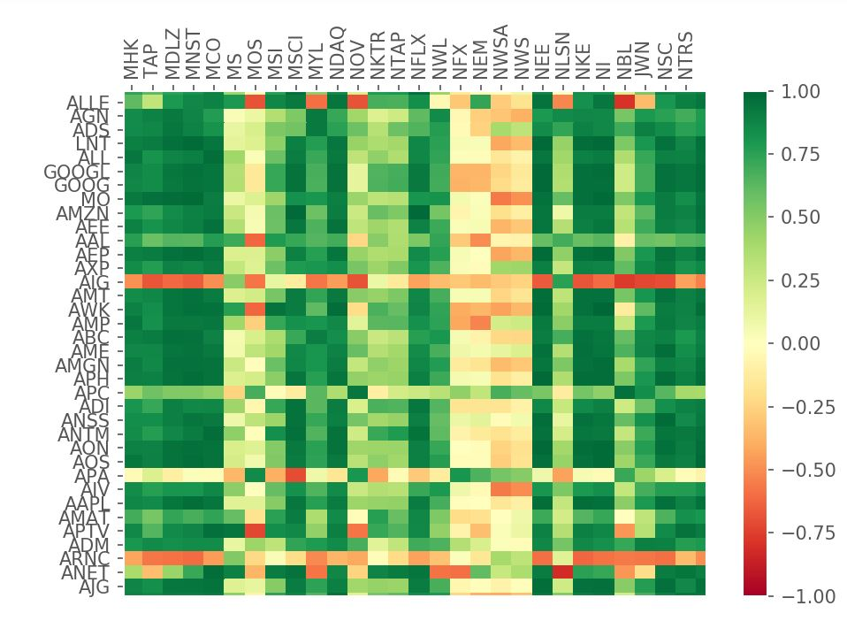
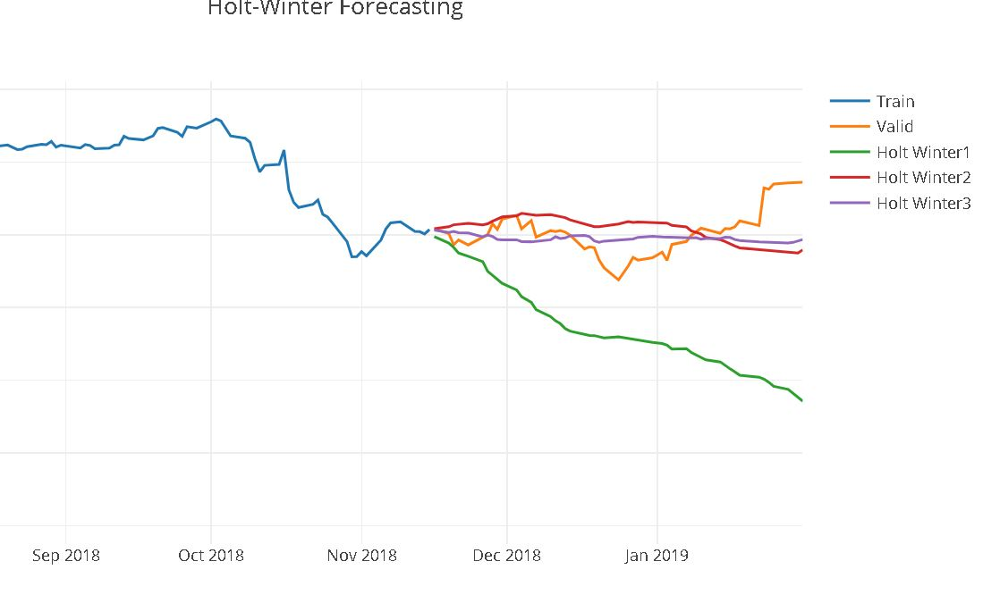
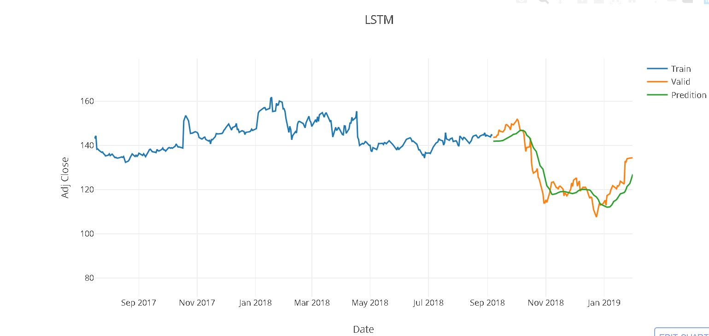

# Stock_Market_Data_Analysis
Dissertation Project, collect, analyse and forecast on S&amp;P 500 companies stocks with 18 years of data using Time Series models, Neural Networks and LSTM.

Data Collected from Wikipedia and Yahoo Finance using Web Scrapping.

## Abstract

This study aims to use the four most popular algorithms i.e. Moving Average, Holt-Winter Model, LSTM and ARIMA to investigate the results to make prediction on stock prices and to compare them based on accuracy. All the methods have been explored into the literature review for the prediction and all the methods compared. It also visualizes the relationship between the five hundred companies in S&P 500 index and other methods to support analysis for developing the better results.
The obtained results revealed that all the models have a strong potential with short-term and the LSTM dependencies for long-term prediction of stock prices based on the pricing history with 5.93 root mean square error.

## Tools

Programming: Python 3.6
Libraries: Beautifulsoup, Pickle, Numpy, Pandas, Datetime, Matplotlib, Plotly, Sklearn, Keras, Tensorflow, Statsmodels, Pyramid-arima 
Features: Visualisation of 500 companies using HeatMap and Piechart
Models: ARIMA Data Analysis, ARIMA Forecasting, LSTM, MLP, Moving Average, Holt-Winter

Report is available on request.
## Moving Average
.png)

## Heat Map of S&P 500 Index 

## Holt - Winter Forecasting

## LSTM 

